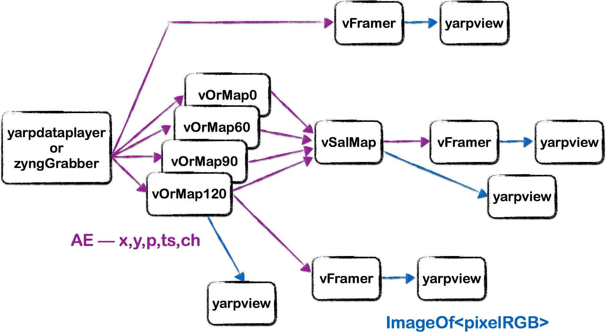
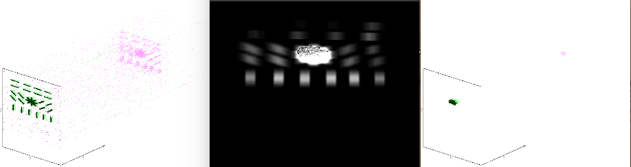

Event-driven saliency map
=============================

Create an event-driven saliency map based on the output of the feature maps created with oriented filters

# Prerequisites
By now, you should know enough about event-driven feature maps ([Orientation Filter](https://github.com/vvv-school/solution_event-orientation-filter)) and _yarpmanager scripts_ (e.g. [in our last assignment](https://github.com/vvv-school/assignment_event-orientation-filter)).

# Assignment
You have to implement a hierarchical model of selective attention, based on the feature maps output developed in the previous assignment.
 
To accomplish this task you have to modify the [app](./app/scripts) to instantiate multiple oriented filter maps, each taking as input the event stream from the cameras and sending their output bottles to a provided saliency-map module. In reality, the saliency-map is very similar to the orientation-filter with some small changes. A solution to the orientation-filter is provided in this assignment if you did not manage to complete assignment 2, but:
**If you prefer to use your own solution to orientation filter (highly recommended) overwrite event-orientation-filter.cpp and event-orientation-filter.hpp with your files from assignment 2**

You have to correctly tune the parameters of the modules by providing the appropriate arguments in the app (tau, Te, theta, strict, ...).

To debug the assignment we recommend you to visualise:

1. The input event-stream (using [vFramer])
1. The output of a feature map (spiking or subthreshold)
1. The subthreshold of the saliency map
1. The spiking output of the saliency map

to correctly tune the parameters. The angles should approximately be 0, 60, 90, and 120 degrees.

Here is an example of how your app could look:

You will run this assignment with the [_Dataset_event-saliency-map_]() dataset. The dataset has bars at different orientations and an object with multiple edges at different orientations. Each feature map will contribute to the energy of the region where the features superimpose and the saliency map will have maximum activity there. The centre and dimension of the maximum activity region will define a region of interest.

Here is what you might see when it is working:

To get a bonus :-)

1. Find the maximum of the Saliency Map and send it using a YARP bottle (non-event type)
1. Find the size of the Region of Interest and send it.

This final work will make you proud, will be extremely useful during the last integration day and will give you more points towards the team leadership....

Once done, you can test your code **Automatically**: [running the script **test.sh**](https://github.com/vvv-school/vvv-school.github.io/blob/master/instructions/how-to-run-smoke-tests.md) in the **smoke-test** directory. 

# [How to complete the assignment](https://github.com/vvv-school/vvv-school.github.io/blob/master/instructions/how-to-complete-assignments.md)
